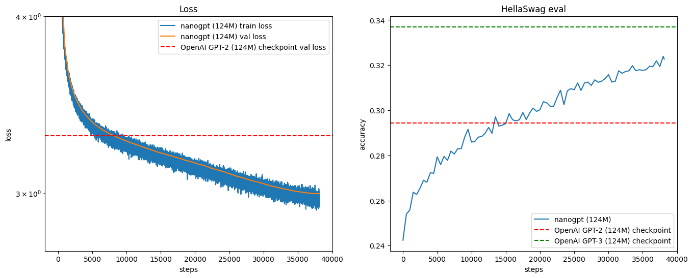

# Training Parameters - GPT-2 124M Reproduction

**Training Date:** 2026-02-05  
**Run ID:** 050226

---

## Model Architecture

| Parameter | Value |
|-----------|-------|
| Model Type | GPT-2 124M |
| Layers (`n_layer`) | 12 |
| Attention Heads (`n_head`) | 12 |
| Embedding Dimension (`n_embd`) | 768 |
| Context Length (`block_size`) | 1024 tokens |
| Vocabulary Size (`vocab_size`) | 50304 (padded from 50257) |
| Total Parameters | ~124M |

### Architecture Details
- **Attention:** Flash Attention (scaled_dot_product_attention)
- **Activation Function:** SwiGLU (gated activation)
- **Positional Encoding:** RoPE (Rotary Position Embedding)
- **Normalization:** RMSNorm
- **Weight Tying:** Token embedding weights shared with LM head

### Key Improvements Over 230126 Run
1. **RoPE Embeddings:** Replaced learned positional embeddings with Rotary Position Embeddings
2. **SwiGLU Activation:** Replaced GELU with SwiGLU in MLP layers
3. **RMSNorm:** Replaced LayerNorm with RMSNorm for better efficiency
4. **2x Training Duration:** Trained for 2 epochs instead of 1

---

## Training Configuration

### Batch Size & Gradient Accumulation
| Parameter | Value |
|-----------|-------|
| Micro-batch Size (`B`) | 32 |
| Sequence Length (`T`) | 1024 tokens |
| Total Batch Size | 524,288 tokens (~0.5M) |
| Gradient Accumulation Steps | Calculated: `524288 / (B × T × num_gpus)` |

### Optimizer Settings
| Parameter | Value |
|-----------|-------|
| Optimizer | AdamW (fused version) |
| Weight Decay | 0.1 |
| Beta1 | 0.9 |
| Beta2 | 0.95 |
| Epsilon | 1e-8 |
| Gradient Clipping | 1.0 (global norm) |

### Learning Rate Schedule
| Parameter | Value |
|-----------|-------|
| Max Learning Rate | 1.8e-3 (3x higher than previous run) |
| Min Learning Rate | 1.8e-4 (10% of max) |
| Warmup Steps | 285 steps (~150M tokens) |
| Total Steps | 38,146 steps (~20B tokens, 2 epochs) |
| Schedule Type | Linear warmup + Cosine decay |

### Training Steps & Evaluation
| Parameter | Value |
|-----------|-------|
| Total Training Steps | 38,146 |
| Validation Frequency | Every 250 steps |
| Validation Steps | 20 batches |
| HellaSwag Eval Frequency | Every 250 steps |
| Checkpoint Frequency | Every 5,000 steps + last step |

---

## Data Configuration

### Dataset
- **Name:** FineWeb-Edu 10BT
- **Source:** HuggingFace
- **Size:** ~10 billion tokens
- **Tokenizer:** GPT-2 BPE (tiktoken)
- **Splits:** Train & Validation shards
- **Training Epochs:** 2 (full dataset seen twice)

### Data Loading Improvements
- **Global shuffling:** All windows shuffled across shards before training
- **Multi-epoch support:** Proper reshuffling between epochs
- **Memory-mapped shards:** Efficient data loading without loading entire dataset into RAM

---

## Hardware & Distributed Training

### Compute Resources
| Parameter | Value |
|-----------|-------|
| GPU Type | NVIDIA RTX 5090 (32GB VRAM) |
| Number of GPUs | 1 |
| Platform | Local machine |
| Training Duration | ~22 hours |
| Estimated Cost | $0 (local) |

### Distributed Setup
| Parameter | Value |
|-----------|-------|
| Framework | Single GPU (no DDP) |
| Backend | N/A |
| Precision | bfloat16 (autocast) |
| Compile | `torch.compile` enabled |
| matmul precision | 'high' (TF32) |

---

## Initialization & Regularization

### Weight Initialization
- **Linear layers:** Normal distribution (mean=0.0, std=0.02)
- **Residual projections:** Scaled by `(2 * n_layer)^(-0.5)` = ~0.0058
- **Embeddings:** Normal distribution (mean=0.0, std=0.02)
- **Biases:** Zeros

### Regularization
- Weight decay applied to 2D+ parameters (weights, embeddings)
- No weight decay for biases and norm parameters
- Gradient clipping at norm 1.0

---

## Training Results

### Final Metrics
| Metric | Value | Reference (GPT-2 Original) | Previous Run (230126) |
|--------|-------|---------------------------|----------------------|
| Validation Loss | 2.99 | ~3.29 | 3.26 |
| HellaSwag Accuracy | 0.32 (32%) | 0.294 (29.4%) | 0.28 (28%) |

### Loss Curve

---

## Implementation Details

### Key Differences from Original GPT-2
1. **Flash Attention:** Used instead of classical attention for speed
2. **AdamW:** Used instead of Adam
3. **bfloat16:** Used for mixed precision training
4. **Vocab Padding:** 50304 instead of 50257 (better GPU utilization)
5. **Modern PyTorch:** torch.compile, fused optimizers, etc.
6. **RoPE Embeddings:** Rotary positional embeddings instead of learned absolute positions
7. **SwiGLU Activation:** Gated activation function instead of GELU
8. **RMSNorm:** More efficient normalization than LayerNorm

### Key Differences from Previous Run (230126)
1. **Higher Learning Rate:** 1.8e-3 vs 6e-4 (3x increase)
2. **Shorter Warmup:** 285 steps vs 715 steps
3. **2x Training Duration:** 38,146 steps vs 19,073 steps (2 epochs)
4. **Larger Micro-batch:** 32 vs 16
5. **RoPE instead of Learned Embeddings:** More robust to sequence length
6. **SwiGLU instead of GELU:** Better performance in modern architectures
7. **RMSNorm instead of LayerNorm:** More efficient normalization

---

## Reproducibility

### Random Seeds
- **Manual Seed:** 1337
- **CUDA Seed:** 1337
- **Generation Seed:** 42 + rank (for distributed generation)

---

## Performance Analysis

### Improvements Over Previous Run
- **HellaSwag Accuracy:** +4 percentage points (28% → 32%)
- **Validation Loss:** -0.27 (3.26 → 2.99)
- **Training Efficiency:** Better utilization with larger batch size

### Contributing Factors
1. **Extended Training:** 2 epochs allowed model to see all data twice
2. **Higher Learning Rate:** Faster convergence with proper warmup
3. **RoPE Embeddings:** Better positional understanding
4. **SwiGLU Activation:** More expressive MLP layers
5. **RMSNorm:** More stable training dynamics

---

### Potential Further Improvements
See `improvements_plan.md` for detailed analysis of potential enhancements.
