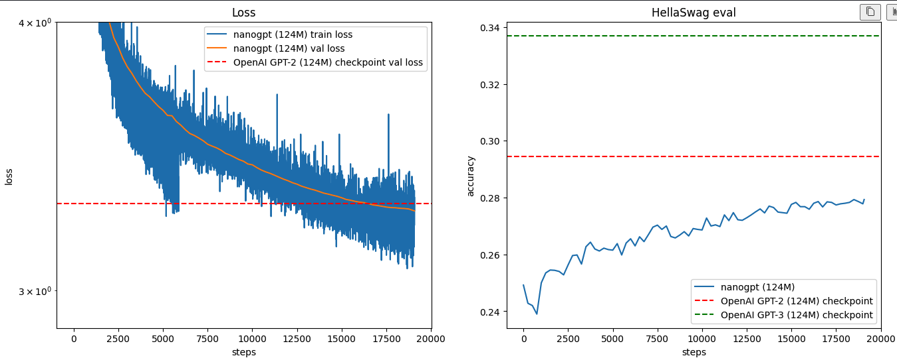

# Training Parameters - GPT-2 124M Reproduction

**Training Date:** 2023-01-26  
**Run ID:** 230126

---

## Model Architecture

| Parameter | Value |
|-----------|-------|
| Model Type | GPT-2 124M |
| Layers (`n_layer`) | 12 |
| Attention Heads (`n_head`) | 12 |
| Embedding Dimension (`n_embd`) | 768 |
| Context Length (`block_size`) | 1024 tokens |
| Vocabulary Size (`vocab_size`) | 50304 (padded from 50257) |
| Total Parameters | ~124M |

### Architecture Details
- **Attention:** Flash Attention (scaled_dot_product_attention)
- **Activation Function:** GELU (tanh approximation)
- **Positional Encoding:** Learned positional embeddings
- **Normalization:** LayerNorm (pre-norm architecture)
- **Weight Tying:** Token embedding weights shared with LM head

---

## Training Configuration

### Batch Size & Gradient Accumulation
| Parameter | Value |
|-----------|-------|
| Micro-batch Size (`B`) | 16 |
| Sequence Length (`T`) | 1024 tokens |
| Total Batch Size | 524,288 tokens (~0.5M) |
| Gradient Accumulation Steps | Calculated: `524288 / (B × T × num_gpus)` |

### Optimizer Settings
| Parameter | Value |
|-----------|-------|
| Optimizer | AdamW (fused version) |
| Weight Decay | 0.1 |
| Beta1 | 0.9 |
| Beta2 | 0.95 |
| Epsilon | 1e-8 |
| Gradient Clipping | 1.0 (global norm) |

### Learning Rate Schedule
| Parameter | Value |
|-----------|-------|
| Max Learning Rate | 6e-4 |
| Min Learning Rate | 6e-5 (10% of max) |
| Warmup Steps | 715 steps (~375M tokens) |
| Total Steps | 19,073 steps (~10B tokens) |
| Schedule Type | Linear warmup + Cosine decay |

### Training Steps & Evaluation
| Parameter | Value |
|-----------|-------|
| Total Training Steps | 19,073 |
| Validation Frequency | Every 250 steps |
| Validation Steps | 20 batches |
| HellaSwag Eval Frequency | Every 250 steps |
| Checkpoint Frequency | Every 5,000 steps + last step |

---

## Data Configuration

### Dataset
- **Name:** FineWeb-Edu 10BT
- **Source:** HuggingFace
- **Size:** ~10 billion tokens
- **Tokenizer:** GPT-2 BPE (tiktoken)
- **Splits:** Train & Validation shards

---

## Hardware & Distributed Training

### Compute Resources
| Parameter | Value |
|-----------|-------|
| GPU Type | NVIDIA RTX 3090 (24GB VRAM) |
| Number of GPUs | 4 |
| Platform | Vast.ai (cloud rental) |
| Training Duration | ~11 hours |
| Estimated Cost | ~$7 USD |

### Distributed Setup
| Parameter | Value |
|-----------|-------|
| Framework | PyTorch DDP (DistributedDataParallel) |
| Backend | NCCL |
| Precision | bfloat16 (autocast) |
| Compile | `torch.compile` enabled |
| matmul precision | 'high' (TF32) |

---

## Initialization & Regularization

### Weight Initialization
- **Linear layers:** Normal distribution (mean=0.0, std=0.02)
- **Residual projections:** Scaled by `(2 * n_layer)^(-0.5)` = ~0.0058
- **Embeddings:** Normal distribution (mean=0.0, std=0.02)
- **Biases:** Zeros

### Regularization
- Weight decay applied to 2D+ parameters (weights, embeddings)
- No weight decay for biases and layer norm parameters
- Gradient clipping at norm 1.0

---

## Training Results

### Final Metrics
| Metric | Value | Reference (GPT-2 Original) |
|--------|-------|---------------------------|
| Validation Loss | 3.26 | ~3.29 |
| HellaSwag Accuracy | 0.28 (28%) | 0.294 (29.4%) |

### Loss Curve

---

## Implementation Details

### Key Differences from Original GPT-2
1. **Flash Attention:** Used instead of classical attention for speed
2. **AdamW:** Used instead of Adam
3. **bfloat16:** Used for mixed precision training
4. **Vocab Padding:** 50304 instead of 50257 (better GPU utilization)
5. **Modern PyTorch:** torch.compile, fused optimizers, etc.

---

## Reproducibility

### Random Seeds
- **Manual Seed:** 1337
- **CUDA Seed:** 1337
- **Generation Seed:** 42 + rank (for distributed generation)

---

### Potential Improvements
See `improvements_plan.md` for detailed analysis of potential enhancements.
